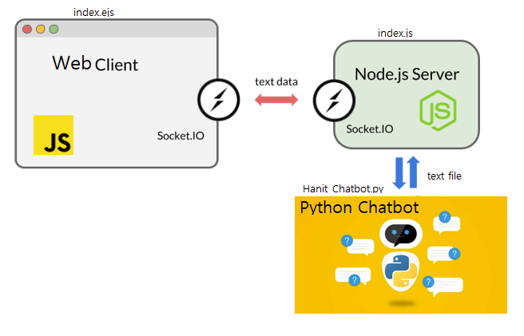

# HitChat

## 한국IT 챗봇 서비스

### 사용 기술 : 
*  인공지능(AI)
* 기계학습(Machine Learning)
* 파이썬(Python)
* 자바 스크립트(Node Js)
* 시퀀스 투 시퀀스(Seq2Seq)
* 트랜스포머(Transformer)
* 자연언어 처리(NLP)
* 챗봇(Chatbot)
* Web Socket

### 프로그램의 흐름
   1. Web Client 에서 질문을 입력한다.
   2. 입력된 질문은 Web Socket 을 통해 Node JS 서버로 전달된다.
   3. JS 서버에서 먼저 정형화된 질문에 대해서는 Web Client로 응답하고 응답 과정을 종료한다.
   4. 예상하지 못한 질문에 대해서는 질문 내용을 텍스트 화일을 기록한다. 
   5. 파이썬 챗봇 서버에서 질문 내용을 읽어 응답을 만들어 기록한다.
   6. JS 서버에서 파이썬 챗봇이 응답한 내용을 파일에서 읽어 Web Client로 응답한다.

### 참고 Site
- Transformer Source Code  https://wikidocs.net/89786
- ChatBot 자료	https://github.com/songys/Chatbot_data (송영숙님)
